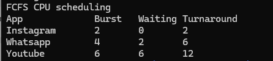

# CPU Scheduling

## Use Case

### Social Media Task Scheduling

This project demonstrates CPU scheduling algorithms by modeling
how tasks generated by a social media platform are scheduled
for CPU execution.

## Programs

### 1. FCFS

First Come, First Served schedules processes based on their
arrival order.

### 2. SJF

Shortest Job First schedules the process with the shortest
burst time first.

## Concepts Used

* CPU Scheduling
* Process Scheduling
* FCFS
* SJF
* Burst Time
* Waiting Time
* Turnaround Time
* Process Execution

## Program Output

### FCFS

