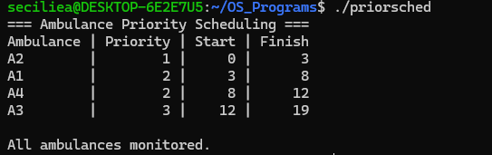
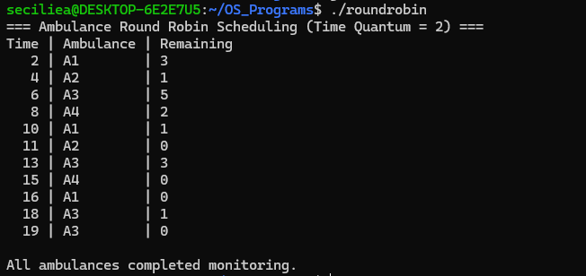
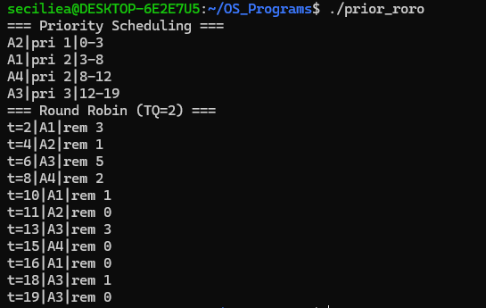

# Priority and Round Robin Scheduling

## Use Case

### Ambulance Monitoring Scheduling

This project demonstrates Priority Scheduling and Round Robin Scheduling by modeling how ambulances are scheduled for patient monitoring.

## Programs

### 1. Priority Scheduling

Priority Scheduling schedules the ambulance with the highest priority first. A lower priority number represents a more critical ambulance.

### 2. Round Robin

Round Robin Scheduling gives each ambulance a fixed time quantum of 2 minutes and continues until all ambulances complete monitoring.

### 3. Priority + Round Robin

This program demonstrates both Priority Scheduling and Round Robin Scheduling together.

## Concepts Used

* CPU Scheduling
* Priority Scheduling
* Round Robin Scheduling
* Time Quantum
* Process Scheduling
* Burst Time
* Priority

## Program Output

### Priority Scheduling

### Round Robin

### Priority + Round Robin

