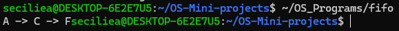
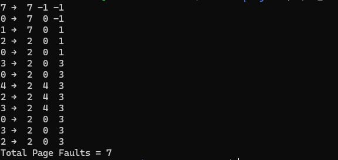
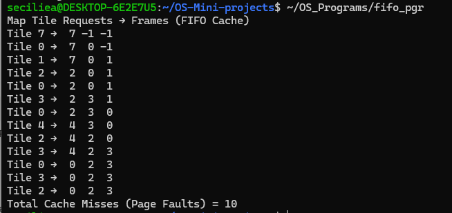

# FIFO and Page Replacement

## Use Case
This project demonstrates FIFO-based searching, page replacement, and FIFO cache/page replacement using simple C programs.

## Programs

### 1. FIFO
File: `FIFO/fifo.c`

Demonstrates Breadth First Search (BFS), where nodes are processed using a FIFO queue.

### 2. Page Replacement
File: `Page_Replacement/pg_replace.c`

Demonstrates page replacement using the Optimal Page Replacement algorithm with 3 frames.

### 3. FIFO Page Replacement
File: `FIFO_Page_Replacement/fifo_pgr.c`

Demonstrates FIFO page replacement using a cache of map tile requests.

## Concepts Used
- FIFO Queue
- Breadth First Search (BFS)
- Page Replacement
- Optimal Page Replacement
- Cache Management
- Page Faults

## Program Output

### FIFO

### Page Replacement

### FIFO Page Replacement

