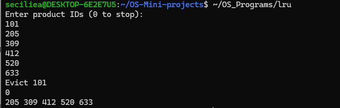
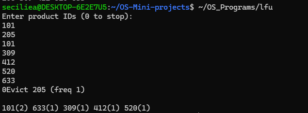

# LRU and LFU

## Use Case
This project demonstrates two cache replacement techniques: Least Recently Used (LRU) and Least Frequently Used (LFU).

## Programs

### 1. LRU
File: `LRU/lru.c`

Demonstrates LRU cache replacement using product IDs. When the cache is full, the oldest item is evicted.

### 2. LFU
File: `LFU/lfu.c`

Demonstrates LFU cache replacement using product IDs. Each item has a frequency count, and a least frequently used item is evicted when the cache is full.

## Concepts Used
- LRU (Least Recently Used)
- LFU (Least Frequently Used)
- Cache Replacement
- Frequency Counting
- Eviction

## Program Output

### LRU

### LFU

