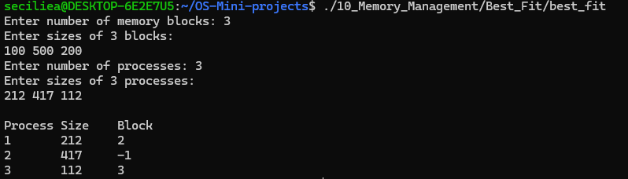
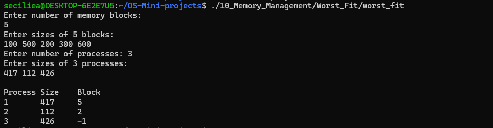
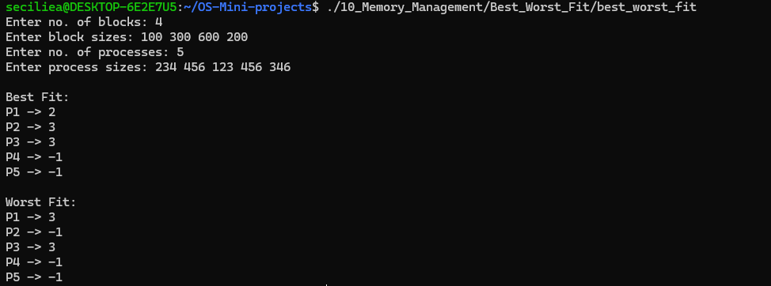

# Memory Management Policies

## Use Case
This project demonstrates memory allocation using Best Fit and Worst Fit memory management policies.

## Programs

### 1. Best Fit
File: `Best_Fit/best_fit.c`

Best Fit allocates a process to the smallest available memory block that is large enough to hold the process.

### 2. Worst Fit
File: `Worst_Fit/worst_fit.c`

Worst Fit allocates a process to the largest available memory block.

### 3. Best Fit and Worst Fit
File: `Best_Worst_Fit/best_worst_fit.c`

This program demonstrates both Best Fit and Worst Fit allocation for the same set of processes.

## Concepts Used
- Memory Management
- Best Fit
- Worst Fit
- Memory Allocation
- Process Allocation
- Memory Blocks

## Program Output

### Best Fit

### Worst Fit

### Best and Worst Fit

