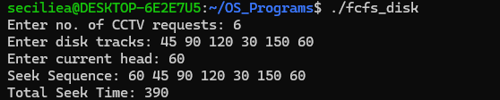
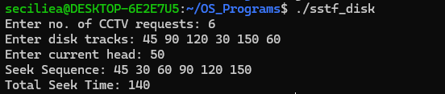
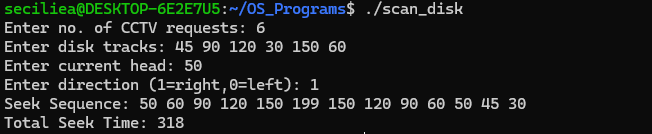
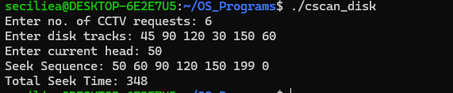

# Disk Scheduling

## Use Case
This project demonstrates four disk scheduling algorithms used to manage disk head movement.

## Programs

### 1. FCFS
File: `FCFS/fcfs_disk.c`

FCFS (First Come First Serve) services disk requests in the same order in which they are received.

### 2. SSTF
File: `SSTF/sstf_disk.c`

SSTF (Shortest Seek Time First) services the disk request that is closest to the current head position.

### 3. SCAN
File: `SCAN/scan_disk.c`

SCAN moves the disk head in one direction, services the requests, reaches the end of the disk, and then moves in the opposite direction.

### 4. C-SCAN
File: `C_SCAN/cscan_disk.c`

C-SCAN services requests in one direction. After reaching the end, the head returns to the beginning and continues servicing requests.

## Concepts Used
- Disk Scheduling
- FCFS
- SSTF
- SCAN
- C-SCAN
- Seek Time
- Disk Head Movement

## Program Output

### FCFS

### SSTF

### SCAN

### C-SCAN

