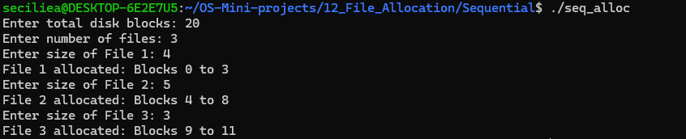
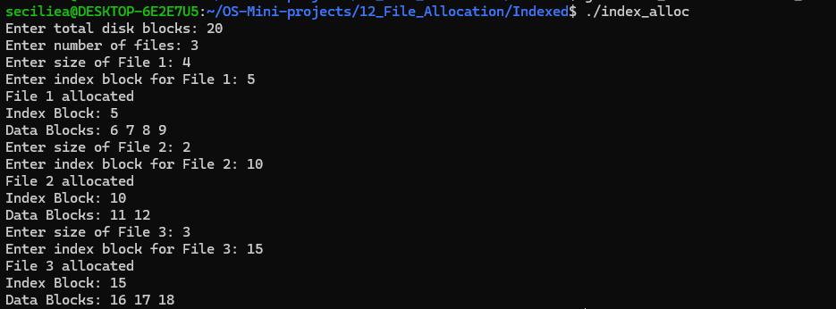

# File Allocation

## Use Case
This project demonstrates Sequential and Indexed file allocation methods used by operating systems to store files on disk.

## Programs

### 1. Sequential File Allocation
File: `Sequential/seq_alloc.c`

Sequential file allocation stores the blocks of a file in consecutive disk locations.

### 2. Indexed File Allocation
File: `Indexed/index_alloc.c`

Indexed file allocation uses an index block to keep track of the data blocks allocated to a file.

## Concepts Used
- File Allocation
- Sequential Allocation
- Indexed Allocation
- Disk Blocks
- File Management

## Program Output

### Sequential File Allocation

### Indexed File Allocation

