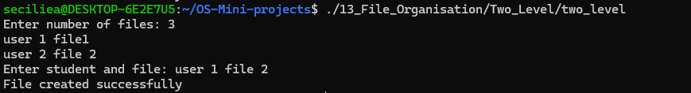

# File Organisation

## Use Case

This project demonstrates Single-Level and Two-Level directory organisation used in operating systems.

## Programs

### 1. Single-Level Directory

File: `Single_Level/single_level.c`

A single-level directory stores files in one directory. The program checks whether a new file already exists before creating it.

### 2. Two-Level Directory

File: `Two_Level/two_level.c`

A two-level directory organises files using users and their file names. The program checks whether a file already exists for a user.

## Concepts Used

- File Organisation
- Single-Level Directory
- Two-Level Directory
- File Management
- Directory Structure

## Program Output

### Single-Level Directory

### Two-Level Directory

